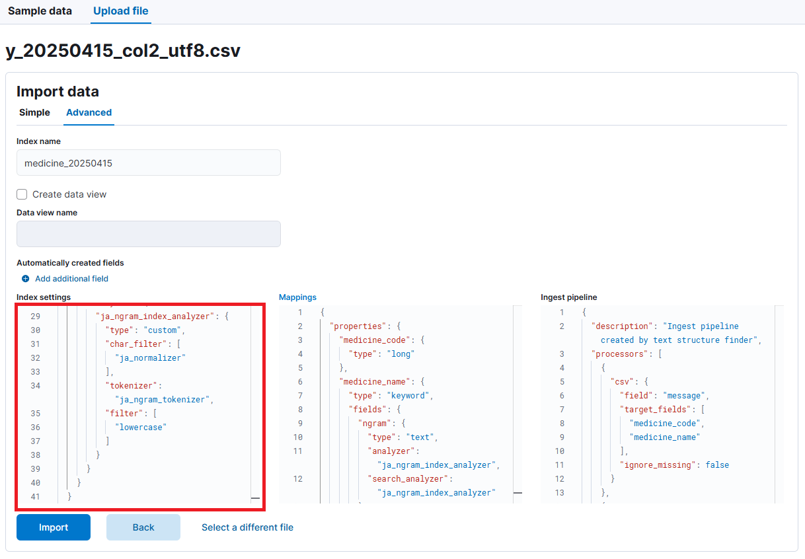

# index settings

CSV ファイルのアップロード時の index settings.



上記の Upload file の Advanced の Index settings で下記を入力する。

```
  {
    "index": {
      "number_of_shards": 1,
      "number_of_replicas": 1,
      "refresh_interval": "5s"
    },
    "analysis": {
      "char_filter": {
        "ja_normalizer": {
          "type": "icu_normalizer",
          "name": "nfkc",
          "mode": "compose"
        }
      },
      "tokenizer": {
        "ja_ngram_tokenizer": {
          "type": "ngram",
          "min_gram": 2,
          "max_gram": 2,
          "token_chars": [
            "letter",
            "digit",
            "punctuation",
            "symbol"
          ]
        }
      },
      "analyzer": {
        "ja_ngram_index_analyzer": {
          "type": "custom",
          "char_filter": [
            "ja_normalizer"
          ],
          "tokenizer": "ja_ngram_tokenizer",
          "filter": [
            "lowercase"
          ]
        }
      }
    }
  }
```

※注 "token_chars" に "puctuation" を含めないと、"%"が無視されてしまう。
