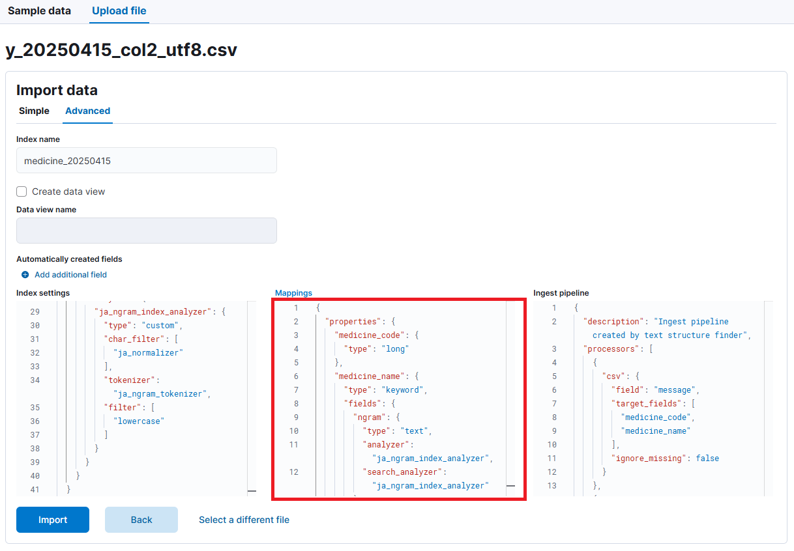

# インデックスのフィールドの作成

CSV ファイルのアップロード時の mappings.



上記の Upload file の Advanced の Mappings で下記を入力する。

```
{
  "properties": {
    "medicine_code": {
      "type": "long"
    },
    "medicine_name": {
      "type": "keyword",
      "fields": {
        "ngram": {
          "type": "text",
          "analyzer": "ja_ngram_index_analyzer",
          "search_analyzer": "ja_ngram_index_analyzer"
        }
      }
    }
  }
}
```

