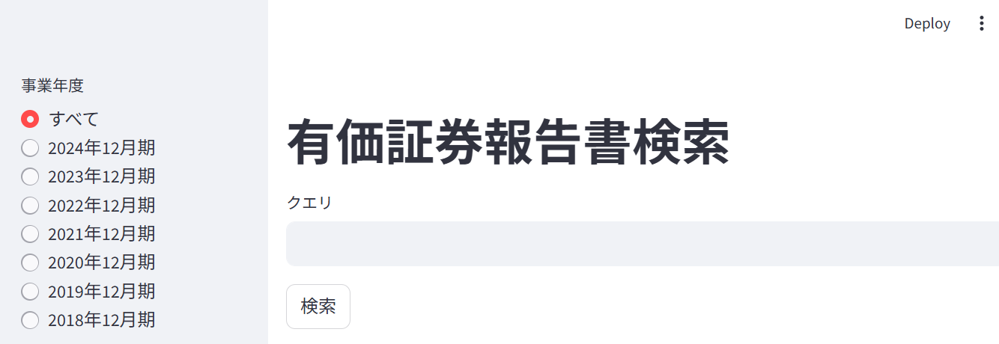
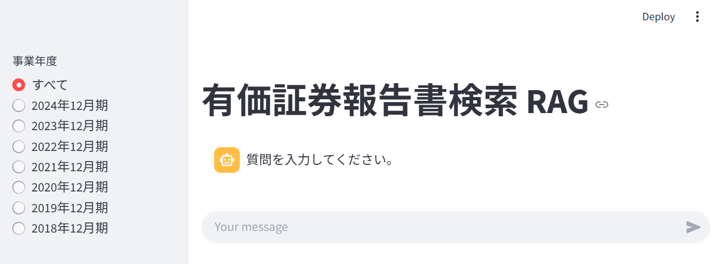

# Elasticsearch でメタ情報を活用した検索を行うサンプルアプリケーション

## 概要

https://elastic.sios.jp/category/blog/ で公開予定のブログ
「Elasticsearch での メタ情報を活用した検索」
で使用したサンプルアプリケーションです。

このサンプルアプリでは、ドキュメントの対象年度をメタデータとして活用し、
対象年度を絞り込んだ上で検索を行います。

## できること

1. メタデータを活用した検索を行うことができます。

## 動作に必要な環境など

- Elasticsearch (筆者は Elastic Cloud 8.18.0 で動作確認)
- Docker (筆者は Rancher Desktop 1.18.2 で動作確認)

その他、下記は、自動でダウンロードされます。

- Python 3.13
- elasticsearch 8.18.1 (Elasticsearch の Python用のClient)
- python-dotenv 1.0.1
- streamlit 1.44.0
- langchain-cohere 0.4.4
- ollama 0.4.8


## 動かし方

### 事前準備

1. 日本語用の形態素解析の設定

[Elasticsearchでの日本語に適したインデックスの作成](https://elastic.sios.jp/blog/creating-an-index-suitable-for-japanese/)
を参考に、日本語の形態素解析の設定を行っておきます。

2. インデックスの作成

[./es_requests/01_create_index_settings.md](./es_requests/01_create_index_settings.md)

に記載しているリクエストをElastic の Kibana の Console から実行します。

3. インデックスのマッピングの設定

[./es_requests/02_create_index_mappings_with_meta.md](./es_requests/02_create_index_mappings_with_meta.md)

に記載しているリクエストをElastic の Kibana の Console から実行します。

4. ドキュメントの登録

[./es_requests/03_post_docs.md](./es_requests/03_post_docs.md)

に記載しているリクエストをElastic の Kibana の Console から実行します。

5. メタ情報を活用した検索テンプレートの登録

[./es_requests/04_search_template_with_meta.md](./es_requests/04_search_template_with_meta.md)

に記載しているリクエストをElastic の Kibana の Console から実行します。

6. 読み取り用 Access Key の作成

[./es_requests/05_create_access_key.md](./es_requests/05_create_access_key.md)

に記載しているリクエストをElastic の Kibana の Console から実行します。

返却された Access Key の encode された文字列を .env ファイルに転記します。

7. Elasticsearch endpoint URL の取得

Elastic Kibana の Home 画面から endpoint の URL を取得します。

取得した URL を .env ファイルに転記します。

8. LLM に関する設定

.env ファイル の llm_model_id, llm_api_key を設定します。

Ollamaを利用する場合は、

- llm_api_key : 'dummy'
- ollama_url : Ollama にアクセスするための URL

を設定してください。

※このサンプルで対応しているモデルは、下記のソースコードに記載しています。

[./app/src/llm/llm_utils.py](./app/src/llm/llm_utils.py)

これら以外のモデルを利用する場合は、適宜修正してみてください。


### ビルド ～ Container との接続

1. ビルド

docker-compose.yml があるディレクトリへ移動します。

```cd app```

docker-compose.yml があるディレクトリで下記を実行します。

```docker compose build```

2. コンテナの起動

```docker compose up -d```

3. コンテナとの接続

```docker exec -it search_with_meta_sample_202505 /bin/bash```

("search_with_meta_sample_202505"はコンテナ名)


### 検索アプリの開始

```streamlit run src/app.py```

Web Browser から http://localhost:8501/ にアクセスして、有価証券報告書の検索を行います。

参考画面



※停止ボタンは用意していないので、停止させたい場合は、Ctrl+C を押すなどの処置を行ってください。

### RAG アプリの開始

```streamlit run src/app.py rag```

Web Browser から http://localhost:8501/ にアクセスして、有価証券報告書の検索を行い、LLMを使って質問に答えます。

参考画面



※停止ボタンは用意していないので、停止させたい場合は、Ctrl+C を押すなどの処置を行ってください。

## ファイルの説明

| 相対ファイルパス | 説明 |
|---|---|
| ./README.md | このファイル |
| app/.env | 接続に必要な API Key などを記載するファイル |
| app/docker-compose.yml | Docker の Compose ファイル |
| app/Dockerfile | Docerfile |
| app/requirements.txt | 動作に必要なライブラリの指定ファイル |
| app/src/common/env_consts.py | .env ファイル関連の定数ファイル |
| app/src/common/load_env_wrapper.py | .env ファイル読み込み関数ファイル |
| app/src/common/setup_logger.py | ロガーの設定関数ファイル |
| app/src/common/st_session_consts.py | Streamlit のセッションに保存するキー名を定義したファイル |
| app/src/common/ui_mode.py | 検索モードとRAGモードの切り替え用ファイル |
| app/src/elastic/es_consts.py | Elasticsearch 関連の定数ファイル |
| app/src/elastic/es_func.py | Elasticsearch 関連の関数ファイル |
| app/src/elastic/security_report_consts.py | 有価証券報告書に関する定数ファイル |
| app/src/llm/cohere/cohere.py | Cohere用の関数ファイル |
| app/src/llm/ollama/ollama.py | Ollama用の関数ファイル |
| app/src/llm/llm_base.py | LLM用の基底クラス |
| app/src/llm/llm_consts.py | LLM用の定数ファイル |
| app/src/llm/llm_utils.py | LLM用のユーティリティクラス |
| app/src/llm/llm_wrapper.py | LLM用のラッパー関数ファイル |
| app/src/app.py | Streamlit用の開始スクリプト |
| es_requests/01_create_index_settings.md | インデックスの作成リクエスト |
| es_requests/02_create_index_mappings_with_meta.md | インデックスのフィールド作成リクエスト |
| es_requests/03_post_docs.md | ドキュメント登録リクエスト |
| es_requests/05_create_access_key.md | メタ情報による絞り込みを可能とした検索テンプレートの作成リクエスト |
| es_requests/05_access_key.md | 読み取り用 Access Key の作成リクエスト |
| es_requests/99_aggs_fiscal_year.md | 事業年度一覧の取得リクエスト |

