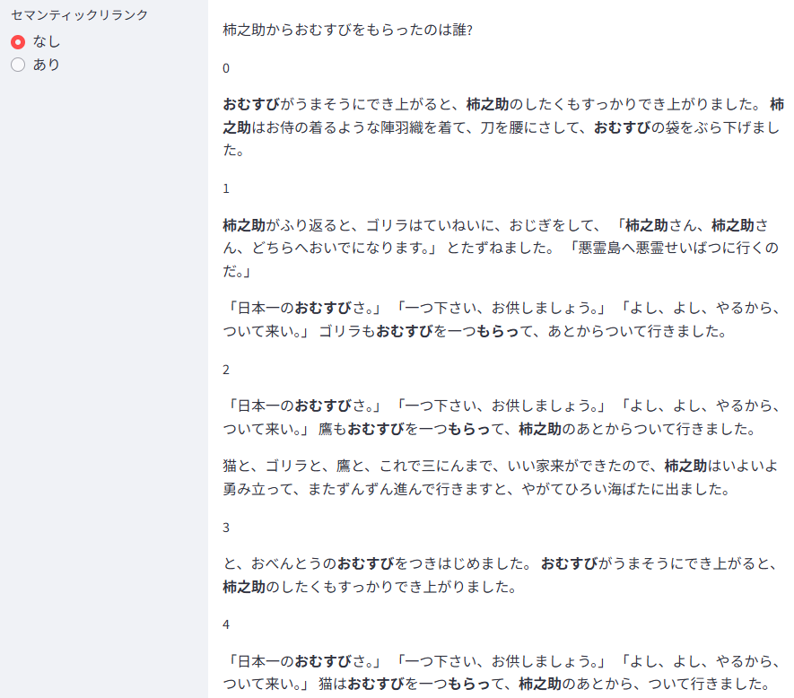
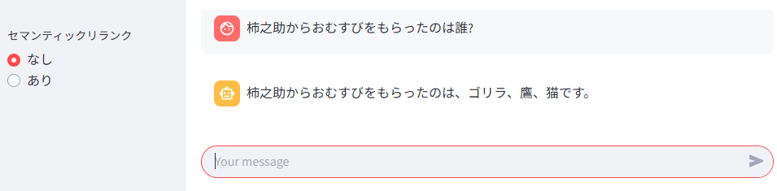
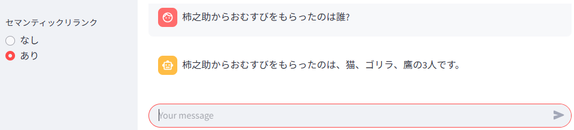

# Elasticsearch でのセマンティックリランクを行うサンプルアプリケーション

# 1. 概要

https://elastic.sios.jp/category/blog/ で公開予定のブログ
「Elasticsearch でのセマンティックリランク」
で使用したサンプルアプリケーションです。

このサンプルアプリでは、「桃太郎」を改変した「柿之助」を登録したインデックスに対し、

- キーワード検索 + 密ベクトル検索 を行う。
- キーワード検索 + 密ベクトル検索 を行った後、セマンティックリランクを行う。

といった処理を行っています。

さらに、LLMを使って質問に答える処理も行っています。（RAG）


# 2. できること

- キーワード検索 + 密ベクトル検索 を行った後、セマンティックリランクを行い、検索結果の並び変えを行うことができます。
- キーワード検索 + 密ベクトル検索 を行った後、セマンティックリランクを行った検索結果をもとに LLM による回答を行うことができます（RAG）。

# 3. 動作に必要な環境など

- Elasticsearch (筆者は Elastic Cloud 8.18.1 (Enterprise License) で動作確認)
- Docker の実行環境 (筆者は Rancher Desktop 1.18.2 で動作確認)

その他、下記は、自動でダウンロードされます。

- Python 3.13
- elasticsearch 8.18.1 (Elasticsearch の Python用のClient)
- python-dotenv 1.0.1
- streamlit 1.44.0
- langchain-cohere 0.4.4


# 4. 動かし方

(*)が付いている箇所が、セマンティックリランクを行う上での重要ポイントとなります。

## 4.1. 日本語用の形態素解析の設定

[Elasticsearchでの日本語に適したインデックスの作成](https://elastic.sios.jp/blog/creating-an-index-suitable-for-japanese/)
を参考に、日本語の形態素解析の設定を行っておきます。


## 4.2. 日本語ベクトル化の設定

[Elasticsearchでのベクトル検索の準備](https://elastic.sios.jp/blog/preparing-for-vector-search/)
を参考に、日本語のベクトル化の設定を行っておきます。


## 4.3. 同義語の登録

[./es_requests/01_create_synonyms.md](./es_requests/01_create_synonyms.md)

に記載しているリクエストをElastic の Kibana の Console から実行します。


## 4.4. インデックスの作成

[./es_requests/02_create_index_settings.md](./es_requests/02_create_index_settings.md)

に記載しているリクエストをElastic の Kibana の Console から実行します。


## 4.5. インデックスのマッピングの設定

[./es_requests/03_create_index_mappings.md](./es_requests/03_create_index_mappings.md)

に記載しているリクエストをElastic の Kibana の Console から実行します。


## 4.6. エイリアスの作成

[./es_requests/04_create_alias.md](./es_requests/04_create_alias.md)

に記載しているリクエストをElastic の Kibana の Console から実行します。


## 4.7. 書き込み用 Access Key の作成

[./es_requests/05_create_access_key.md](./es_requests/05_create_access_key.md)

に記載している書き込み用 Access Key の作成リクエストをElastic の Kibana の Console から実行します。

返却された Access Key の encode された文字列を .env ファイルに転記します。


## 4.8. 読み取り用 Access Key の作成

[./es_requests/05_create_access_key.md](./es_requests/05_create_access_key.md)

に記載している読み取り用 Access Key の作成リクエストをElastic の Kibana の Console から実行します。

返却された Access Key の encode された文字列を .env ファイルに転記します。


## 4.9. ハイブリッド検索を行う検索テンプレートの登録（セマンティックリランクなし）

[./es_requests/06_create_search_template_without_rerank.md](./es_requests/06_create_search_template_without_rerank.md)

に記載しているリクエストをElastic の Kibana の Console から実行します。


## 4.10. Cohere からの API Key の入手 (*)

http://cohere.com/ から Cohere の API Key を入手します。

入手した API Key は、.env ファイルの llm_api_key に記載しておきます。


## 4.11. セマンティックリランク用の inference の作成 (*)

[./es_requests/07_create_inference_rerank.md](./es_requests/07_create_inference_rerank.md)

に記載しているリクエストの <CohereのAPI-Key> と書かれている箇所を、さきほど入手した Cohere の API Key で置換します。

置換後のリクエストを Elastic の Kibana の Console から実行します。


## 4.12. ハイブリッド検索後にセマンティックリランクを行う検索テンプレートの登録 (*)

[./es_requests/08_create_search_template_with_rerank.md](./es_requests/08_create_search_template_with_rerank.md)

に記載しているリクエストをElastic の Kibana の Console から実行します。


## 4.13. Elasticsearch endpoint URL の取得

Elastic Kibana の Home 画面から Elasticsearch の endpoint の URL を取得します。

取得した URL を .env ファイルに転記します。


## 4.14. LLM に関する設定

.env ファイル の llm_model_id を設定します。


※このサンプルで対応しているモデルは、下記のソースコードに記載しています。

[./app/src/llm/llm_utils.py](./app/src/llm/llm_utils.py)


## ※ベクトル生成用のパイプライン

今回は、密ベクトルの生成に .multilingual-e5-small_linux-x86_64 を利用しています。

このモデルを利用する場合、以前のバージョンではドキュメント登録後のベクトル生成用の
inference を事前に作成しておく必要がありました。

Elasticsearch v8.18 では、あらかじめ
__.multilingual-e5-small-elasticsearch__
という名前で inference が用意されています。
今回は、これを利用しています。


# 5. ビルド ～ Container との接続

## 5.1. ビルド

docker-compose.yml があるディレクトリへ移動します。

```cd app```

docker-compose.yml があるディレクトリで下記を実行します。

```docker compose build```

## 5.2. コンテナの起動

```docker compose up -d```

## 5.3. コンテナとの接続

```docker exec -it semantic_rerank_sample_202505 /bin/bash```

("semantic_rerank_sample_202505"はコンテナ名)


## 5.4. 「柿之助」のドキュメントの登録

```
python src/bulk_main.py data/kakinosuke.txt.json
```

data/kakinosuke.txt.json は、「柿之助」のお話をあらかじめチャンク分割し json フォーマットで保存したものです。
## 5.5. 検索アプリの開始

```streamlit run src/app.py```

Web Browser から http://localhost:8501/ にアクセスして、「柿之助」の検索を行います。

参考画面

検索モードの開始画面


セマンティックリランクなしでの検索結果



セマンティックリランクありでの検索結果


※停止ボタンは用意していないので、停止させたい場合は、Ctrl+C を押すなどの処置を行ってください。

## 5.6. RAG アプリの開始

```streamlit run src/app.py rag```

Web Browser から http://localhost:8501/ にアクセスして、「柿之助」の検索を行い、LLMを使って質問に答えます。

参考画面

RAG モードの開始画面


セマンティックリランクなしでの RAG の回答結果



※この質問の例では、セマンティックリランク前でも、そこそこの順位だったために、LLM がうまく拾い上げて
正しい回答がなされています。

セマンティックリランクありでの RAG の回答結果




※停止ボタンは用意していないので、停止させたい場合は、Ctrl+C を押すなどの処置を行ってください。

# 6. ファイルの説明

| 相対ファイルパス | 説明 |
|---|---|
| ./README.md | このファイル |
| [app/.env](app/.env) | 接続に必要な API Key などを記載するファイル |
| [app/docker-compose.yml](app/docker-compose.yml) | Docker の Compose ファイル |
| [app/Dockerfile](app/Dockerfile) | Docerfile |
| [app/requirements.txt](app/requirements.txt) | 動作に必要なライブラリの指定ファイル |
| [app/data/kakinosuke.txt](app/data/kakinosuke.txt) | 「桃太郎」を改変した「柿之助」のテキスト |
| [app/data/kakinosuke.txt.json](app/data/kakinosuke.txt.json) | kakinosuke.txt をチャンク分割し、json 形式で保存したファイル |
| [app/data/README.md](app/data/README.md) | このフォルダ内のファイルの説明 |
| [app/src/common/app_consts.py](app/src/common/app_consts.py) | このアプリ全般の定数ファイル |
| [app/src/common/env_consts.py](app/src/common/env_consts.py) | .env ファイル関連の定数ファイル |
| [app/src/common/load_env_wrapper.py](app/src/common/load_env_wrapper.py) | .env ファイル読み込み関数ファイル |
| [app/src/common/setup_logger.py](app/src/common/load_env_wrapper.py) | ロガーの設定関数ファイル |
| [app/src/common/st_consts.py](app/src/common/st_consts.py) | Streamlit に関する定数ファイル |
| [app/src/common/ui_mode.py](app/src/common/ui_mode.py) | 検索モードとRAGモードの切り替え用ファイル |
| [app/src/elastic/es_consts.py](app/src/elastic/es_consts.py) | Elasticsearch 関連の定数ファイル |
| [app/src/elastic/es_func.py](app/src/elastic/es_func.py) | Elasticsearch 関連の関数ファイル |
| [app/src/elastic/kakinosuke_consts.py](app/src/elastic/kakinosuke_consts.py) | 「柿之助」に関する定数ファイル |
| [app/src/llm/cohere/cohere.py](app/src/llm/cohere/cohere.py) | Cohere用の関数ファイル |
| [app/src/llm/llm_base.py](app/src/llm/llm_base.py) | LLM用の基底クラス |
| [app/src/llm/llm_consts.py](app/src/llm/llm_consts.py) | LLM用の定数ファイル |
| [app/src/llm/llm_utils.py](app/src/llm/llm_utils.py) | LLM用のユーティリティクラス |
| [app/src/llm/llm_wrapper.py](app/src/llm/llm_wrapper.py) | LLM用のラッパー関数ファイル |
| [app/src/text/chunk_utils.py](app/src/text/chunk_utils.py) | チャンク分割用のユーティリティ関数ファイル |
| [app/src/app.py](app/src/app.py) | Streamlit用の開始スクリプト |
| [app/src/bulk_main.py](app/src/bulk_main.py) | ドキュメントの登録用スクリプト |
| [app/src/split_text_main.py](app/src/split_text_main.py) | テキストファイルをチャンク分割するスクリプト |
| [es_requests/01_create_synonyms.md](es_requests/01_create_synonyms.md) | 同義語セットの作成リクエスト |
| [es_requests/02_create_index_settings.md](es_requests/02_create_index_settings.md) | インデックスの作成リクエスト |
| [es_requests/03_create_index_mappings.md](es_requests/03_create_index_mappings.md) | インデックスのフィールド作成リクエスト |
| [es_requests/04_create_alias.md](es_requests/04_create_alias.md) | エイリアスの作成リクエスト |
| [es_requests/05_create_access_key.md](es_requests/05_create_access_key.md) | 書き込み用 Access Key および 読み込み用 Access Key の作成リクエスト |
| [es_requests/06_create_search_template_without_rerank.md](es_requests/06_create_search_template_without_rerank.md) | リランクなしの検索テンプレートの作成リクエスト |
| [es_requests/07_create_inference_rerank.md](es_requests/07_create_inference_rerank.md) | リランク用のエンドポイントの作成リクエスト |
| [es_requests/08_create_search_template_with_rerank.md](es_requests/08_create_search_template_with_rerank.md) | リランクありの検索テンプレートの作成リクエスト |

