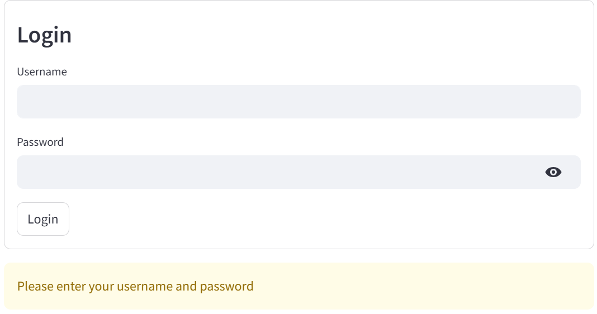
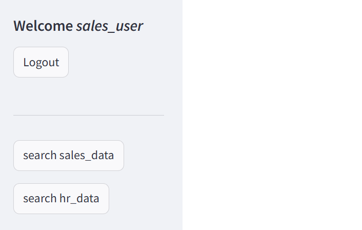
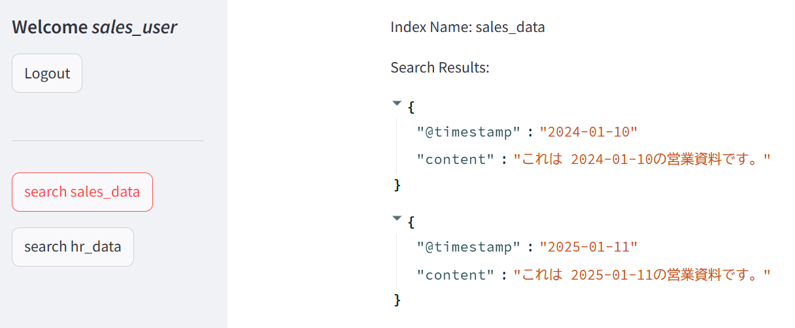
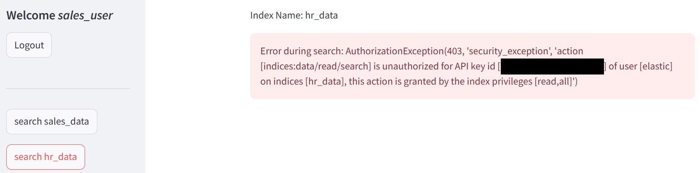
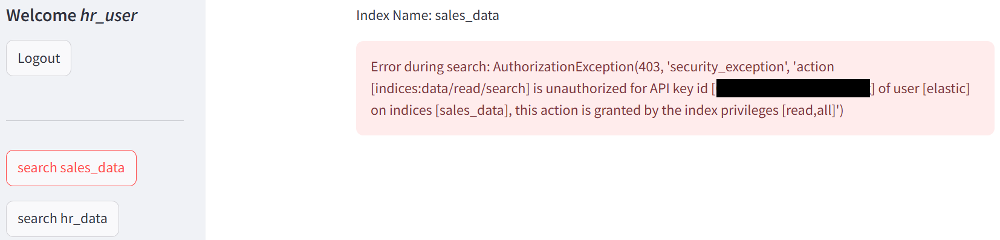
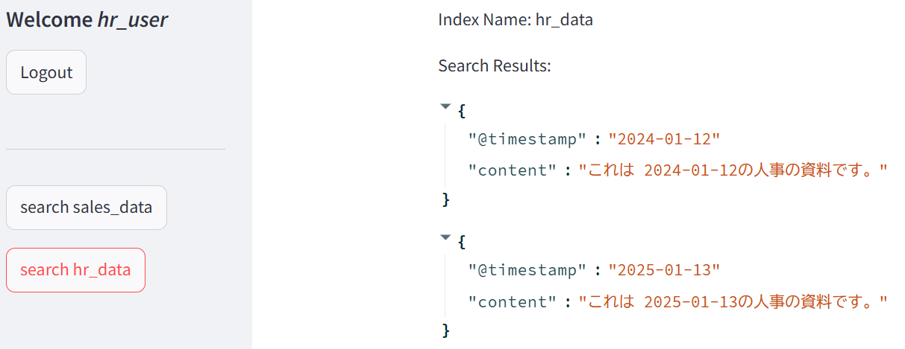
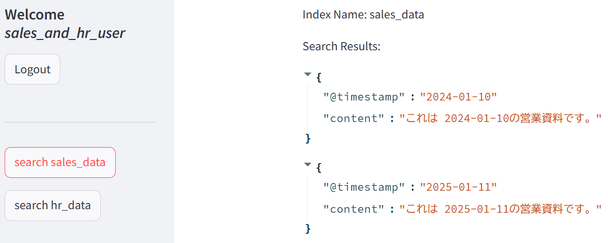
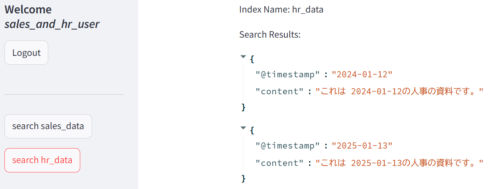

# Elasticsearchのインデックスに対するアクセス制御（API経由での動作確認）を行うサンプルアプリケーション

# 1. 概要

https://elastic.sios.jp/category/blog/ で公開予定のブログ
「Elasticsearchのインデックスに対するアクセス制御（API経由での動作確認）」
で使用したサンプルアプリケーションです。

このサンプルアプリでは、saled_data* インデックス、および、hr_data* インデックスに対し、

- sales_data* インデックスへの読み取り権限を持った API Key によるアクセス
- hr_data* インデックスへの読み取り権限を持った API Key によるアクセス
- sales_data* インデックス、および、hr_data* インデックスへの読み取り権限を持った API Key によるアクセス

を行っています。


# 2. できること

- API Key を使って、インデックスごとの読み取り権を使い分けることができます。

# 3. 動作に必要な環境など

- Elasticsearch (筆者は Elastic 8.15.5 (Basic License) で動作確認)
- Docker の実行環境 (筆者は Rancher Desktop 1.19.1 で動作確認)

その他、下記は、自動でダウンロードされます。

- Python 3.13
- elasticsearch 8.15.1 (Elasticsearch の Python用のClient)
- streamlit 1.42.2
- streamlit-authenticator 0.4.2


# 4. 動かし方

## 4.1. インデックスの作成

[./es_requests/1_create_index.md](./es_requests/1_create_index.md)

に記載しているリクエストをElastic の Kibana の Console から実行します。


## 4.2. インデックスのマッピングの設定

[./es_requests/2_create_index_mapping.md](./es_requests/2_create_index_mapping.md)

に記載しているリクエストをElastic の Kibana の Console から実行します。


## 4.3. エイリアスの作成

[./es_requests/3_create_alias.md](./es_requests/3_create_alias.md)

に記載しているリクエストをElastic の Kibana の Console から実行します。


## 4.4. ドキュメントの登録

[./es_requests/4_post_doc.md](./es_requests/4_post_doc.md)

に記載しているリクエストをElastic の Kibana の Console から実行します。


## 4.5. 読み取り用 API Key の作成

[./es_requests/5_create_api_key.md](./es_requests/5_create_api_key.md)

に記載している読み取り用 Access Key の作成リクエストをElastic の Kibana の Console から実行します。

返却された Access Key の encode された文字列を config.yaml ファイルに転記します。


## 4.6. Elasticsearch endpoint URL の取得

Elastic Kibana の Home 画面から Elasticsearch の endpoint の URL を取得します。

取得した URL を config.yaml ファイルに転記します。


# 5. ビルド ～ Container との接続

## 5.1. ビルド

docker-compose.yml があるディレクトリへ移動します。

```cd app```

docker-compose.yml があるディレクトリで下記を実行します。

```docker compose build```

## 5.2. コンテナの起動

```docker compose up -d```

## 5.3. コンテナとの接続

```docker exec -it rbac_sample_202506 /bin/bash```

("rbac_sample_202506"はコンテナ名)


# 6. サンプルプログラムの実行

## 6.1. ログイン画面の表示

```streamlit run src/app.py```

Web Browser から http://localhost:8501/ にアクセスします。



## 6.2. ユーザーごとの動作の確認

### 6.2.1. sales_user

まず、sales_user でログインしてみます。
パスワードは、config.yaml に記載したものを入力します。

成功すると、検索画面へ遷移します。



[search sales_data] ボタンを押してみます。

sales_data* インデックスへの読み取り権があるので、成功します。



続いて [search hr_data] ボタンを押してみます。

hr_data* インデックスへの読み取り権がないため、エラーとなります。



[Logout] ボタンを押してログアウトします。

### 6.2.2. hr_user

同様に hr_user でも動作確認してみます。

hr_user でログインします。
パスワードは、config.yaml に記載したものを入力します。

成功すると、検索画面へ遷移します。

[search sales_data] ボタンを押してみます。

sales_data* インデックスへの読み取り権がないため、エラーとなります。



続いて [search hr_data] ボタンを押してみます。

hr_data* インデックスへの読み取り権があるので、成功します。



[Logout] ボタンを押してログアウトします。

### 6.2.3. sales_and_hr_user

最後に sales_and_hr_user で動作確認します。

sales_and_hr_user でログインします。
パスワードは、config.yaml に記載したものを入力します。

成功すると、検索画面へ遷移します。

[search sales_data] ボタンを押してみます。

sales_data* インデックスへの読み取り権があるので、成功します。



続いて [search hr_data] ボタンを押してみます。

hr_data* インデックスへの読み取り権があるので、成功します。



[Logout] ボタンを押してログアウトします。


※停止ボタンは用意していないので、停止させたい場合は、Ctrl+C を押すなどの処置を行ってください。

# 7. ファイルの説明

| 相対ファイルパス | 説明 |
|---|---|
| ./README.md | このファイル |
| [app/.config.yaml](app/config.yaml) | 接続に必要な API Key などを記載するファイル |
| [app/docker-compose.yml](app/docker-compose.yml) | Docker の Compose ファイル |
| [app/Dockerfile](app/Dockerfile) | Docerfile |
| [app/requirements.txt](app/requirements.txt) | 動作に必要なライブラリの指定ファイル |
| [app/src/common/setup_logger.py](app/src/common/setup_logger.py) | ロガーの設定関数ファイル |
| [app/src/elastic/es_consts.py](app/src/elastic/es_consts.py) | Elasticsearch 関連の定数ファイル |
| [app/src/elastic/es_func.py](app/src/elastic/es_func.py) | Elasticsearch 関連の関数ファイル |
| [app/src/app.py](app/src/app.py) | Streamlit用の開始スクリプト |
| [es_requests/1_create_index.md](es_requests/1_create_index.md) | インデックスの作成リクエスト |
| [es_requests/2_create_index_mapping.md](es_requests/2_create_index_mapping.md) | インデックスのフィールド作成リクエスト |
| [es_requests/3_create_alias.md](es_requests/3_create_alias.md) | エイリアスの作成リクエスト |
| [es_requests/4_post_doc.md](es_requests/4_post_doc.md) | ドキュメントの登録リクエスト |
| [es_requests/5_create_api_key.md](es_requests/5_create_api_key.md) | 読み込み用 API Key の作成リクエスト |

