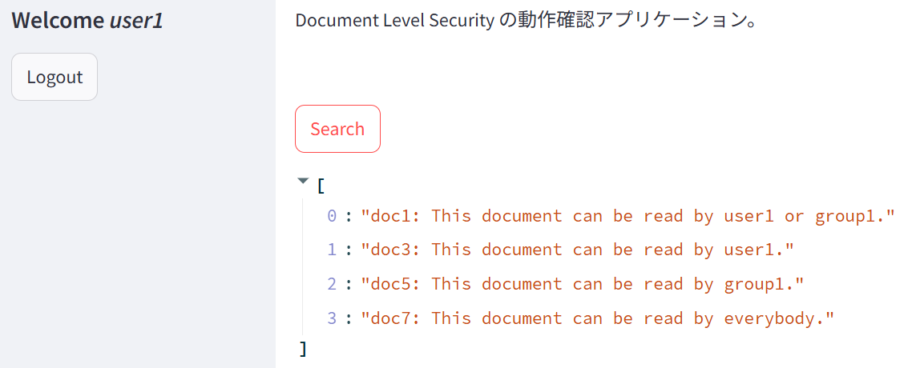

# Elasticsearchのドキュメントごとのアクセス制御（Document Level Security）サンプルアプリケーション

## 1. 概要

https://elastic.sios.jp/category/blog/ で公開予定のブログ
「Elasticsearchのドキュメントごとのアクセス制御（Document Level Security）」
で使用するサンプルアプリケーションです。

このサンプルアプリでは、`dls_sample_202507` インデックスに対し、

- user1 または group1 で読み取り可能なドキュメント
- user2 または group2 で読み取り可能なドキュメント
- user1 でのみ読み取り可能なドキュメント
- user2 でのみ読み取り可能なドキュメント
- group1 でのみ読み取り可能なドキュメント
- group2 でのみ読み取り可能なドキュメント
- 全員が読み取り可能なドキュメント

を登録し、それらを検索しています。

## 2. できること

- ユーザーが保持する読み取り権限に応じて、読み取り可能なドキュメントのみが検索されることを確認できます。

## 3. 動作に必要な環境

- Elasticsearch（Platinum License 以上）  
  ※筆者は Elasticsearch 9.0.3 Enterprise License で動作確認
- Docker 実行環境  
  ※筆者は Rancher Desktop 1.19.1 で動作確認

その他、下記は自動でダウンロードされます。

- Python 3.13
- elasticsearch 9.0.2（Elasticsearch の Python用クライアント）
- streamlit 1.42.2
- streamlit-authenticator 0.4.2

## 4. 動かし方

### 4.1. インデックスの作成

[./es_requests/1_create_index.md](./es_requests/1_create_index.md)  
に記載しているリクエストを Elastic の Kibana の Console から実行します。

### 4.2. インデックスのマッピング設定

[./es_requests/2_create_index_mapping.md](./es_requests/2_create_index_mapping.md)  
に記載しているリクエストを Elastic の Kibana の Console から実行します。

---

### 4.3. ドキュメントの登録

[./es_requests/3_post_doc.md](./es_requests/3_post_doc.md)  
に記載しているリクエストを Elastic の Kibana の Console から実行します。

### 4.4. 読み取り用 API Key の作成

[./es_requests/4_create_api_key.md](./es_requests/4_create_api_key.md)  
に記載しているリクエストを Elastic の Kibana の Console から実行します。

返却された API Key のエンコードされた文字列を `config.yaml` ファイルの `encoded_api_key` に転記します。

### 4.5. Elasticsearch endpoint URL の取得

Elastic Kibana の Home 画面から Elasticsearch の endpoint の URL を取得します。

取得した URL を `config.yaml` ファイルの `endpoint` に転記します。

## 5. ビルド ～ コンテナとの接続

### 5.1. ビルド

`docker-compose.yml` があるディレクトリへ移動します。

```
cd app
```

そのディレクトリで下記を実行します。

```
docker compose build
```

### 5.2. コンテナの起動

```
docker compose up -d
```

### 5.3. コンテナへの接続

```
docker exec -it dls_sample_202507 /bin/bash
```

（"dls_sample_202507"はコンテナ名）

## 6. サンプルプログラムの実行

### 6.1. ログイン画面の表示

dls_sample_202507 コンテナ上の bash から次のコマンドを実行します。

```
streamlit run src/app.py
```

Webブラウザから http://localhost:8501/ にアクセスします。


### 6.2. ユーザーごとの動作確認

#### 6.2.1. user1

まず user1 でログインします。パスワードは `config.yaml` に記載したものを入力します。

成功すると検索画面へ遷移します。


[Search] ボタンを押します。

user1 が参照可能なドキュメントのみが検索されます。



動作確認が終わったら [Logout] ボタンを押してログアウトします。

#### 6.2.2. user2

同様に user2 でも動作確認します。

user2 でログインし、パスワードは `config.yaml` に記載したものを入力します。

成功すると検索画面へ遷移します。

[Search] ボタンを押します。

user2 が参照可能なドキュメントのみが検索されます。


[Logout] ボタンを押してログアウトします。

#### 6.2.3. user3

同様に user3 でも動作確認します。

user3 でログインし、パスワードは `config.yaml` に記載したものを入力します。

成功すると検索画面へ遷移します。

[Search] ボタンを押します。

user3 が参照可能なドキュメントのみが検索されます。


[Logout] ボタンを押してログアウトします。

#### 6.2.4. user4

最後に user4 で動作確認します。

user4 でログインし、パスワードは `config.yaml` に記載したものを入力します。

成功すると検索画面へ遷移します。

[Search] ボタンを押します。

user4 が参照可能なドキュメントのみが検索されます。


[Logout] ボタンを押してログアウトします。

※停止ボタンは用意していないため、停止させたい場合は Ctrl+C を押すなどの処置を行ってください。

## 7. ファイルの説明

| 相対ファイルパス | 説明 |
|---|---|
| ./README.md | このファイル |
| [app/config.yaml](app/config.yaml) | 接続に必要な API Key などを記載するファイル |
| [app/docker-compose.yml](app/docker-compose.yml) | Docker Compose ファイル |
| [app/Dockerfile](app/Dockerfile) | Dockerfile |
| [app/requirements.txt](app/requirements.txt) | 動作に必要なライブラリの指定ファイル |
| [app/src/common/session_consts.py](app/src/common/session_consts.py) | セッション関連の定数ファイル |
| [app/src/common/setup_logger.py](app/src/common/setup_logger.py) | ロガーの設定関数ファイル |
| [app/src/elastic/es_consts.py](app/src/elastic/es_consts.py) | Elasticsearch 関連の定数ファイル |
| [app/src/elastic/es_func.py](app/src/elastic/es_func.py) | Elasticsearch 関連の関数ファイル |
| [app/src/app.py](app/src/app.py) | Streamlit用の開始スクリプト |
| [es_requests/1_create_index.md](es_requests/1_create_index.md) | インデックスの作成リクエスト |
| [es_requests/2_create_index_mapping.md](es_requests/2_create_index_mapping.md) | インデックスのフィールド作成リクエスト |
| [es_requests/3_post_doc.md](es_requests/3_post_doc.md) | ドキュメントの登録リクエスト |
| [es_requests/4_create_api_key.md](es_requests/4_create_api_key.md) | 読み取り用 API Key の作成リクエスト |
